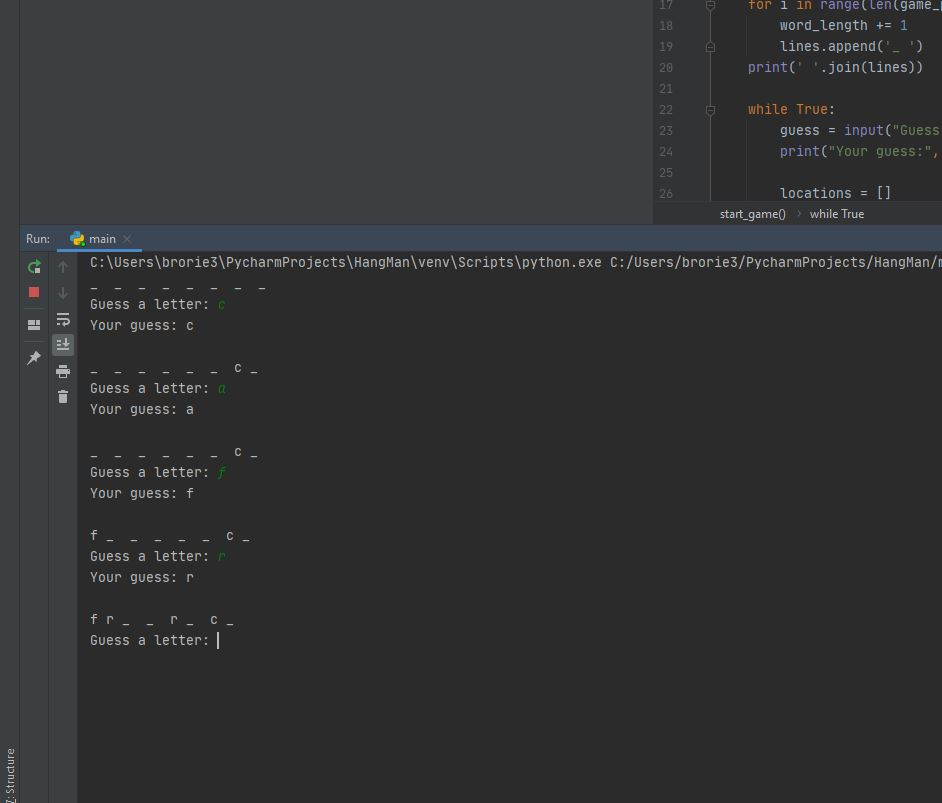
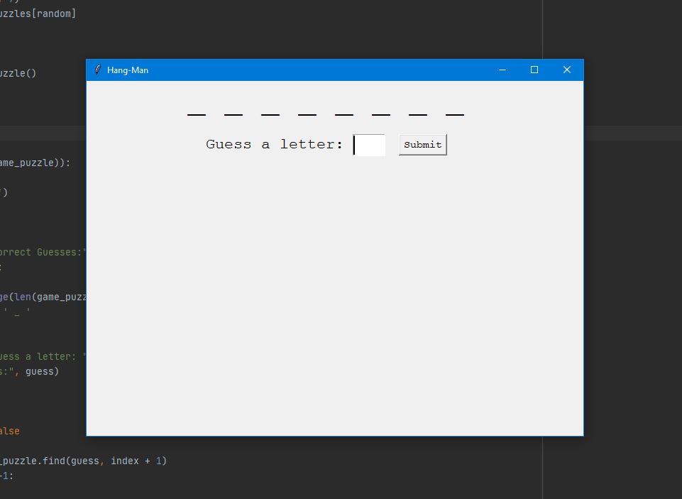

# Hangman
This is the hangman game. The goal of this project is to practice Python and familiarize myself with datastructures and the syntax. The idea is to crearte more advanced versions of the game as we go. 

### Day 1-2
- (Day 1) created a basic text version of hangman
  - (Day 2) added a system that counts attempts
  - (Day 2) added a system that allows users to make a final guess

### Day 2
- (Day 2) created a basic GUI design
  - (Day 2) implemented the basic systems from the text version of the game

